<div align="center">

# djangomap

**Turn any Django project into a beautiful, interactive architecture diagram.**

Models · Views · URLs · Celery tasks · Beat schedules · Signals · Middleware · Admin · Serializers

<p>
  
  
  
  
</p>
<p>
  
  
  
  
  
</p>

[Why](#why) · [Quick start](#quick-start) · [The three tabs](#the-three-tabs) · [CLI](#cli-reference) · [CI](#ci-integration) · [How it works](#how-it-works) · [License](#license)

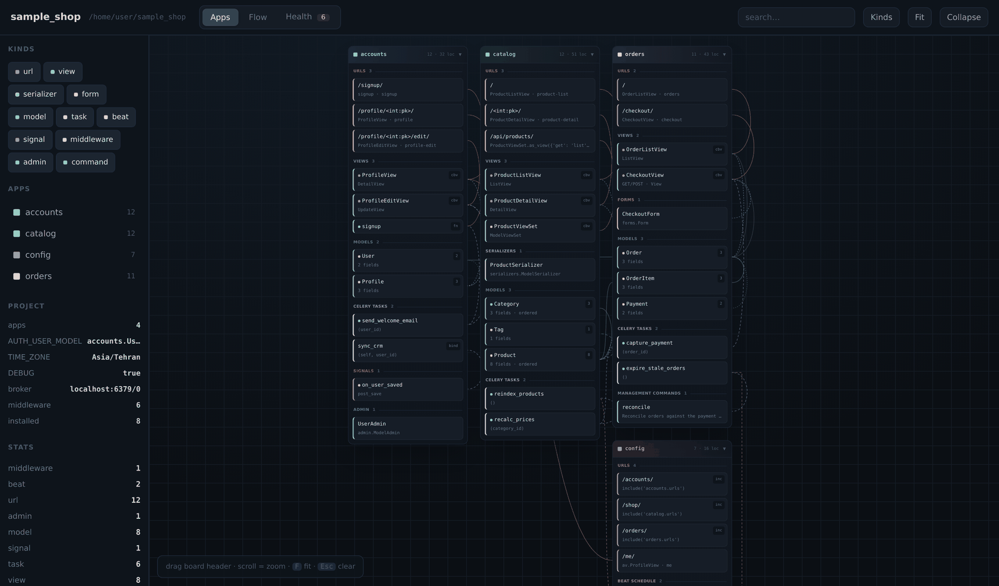

</div>

---

## Why

You join a Django codebase with 40 apps. Which view serves `/checkout/`? What fires
`capture_payment`? Which models does the admin actually expose? Answering these means
grepping across dozens of files.

`djangomap` reads your project **without importing it** and produces a **single HTML
file** that answers those questions visually — plus it flags N+1 risks, circular app
dependencies and missing `related_name`s along the way.

| | |
|---|---|
| **Zero setup** | No database, no `DJANGO_SETTINGS_MODULE`, no installing the target project's dependencies |
| **Zero dependencies** | Pure Python standard library — `ast` and nothing else |
| **Fully offline** | Tailwind is pre-compiled and inlined; the page makes no network requests |
| **One file** | Email it, commit it, attach it to a PR, open it from disk |
| **Responsive** | Works on desktop, tablet and phone |

---

## Quick start

```bash
pip install djangomap
djangomap /path/to/your/project -o diagram.html
open diagram.html
```

That's it. For the full experience, add source links:

```bash
djangomap . \
  --title "My Shop" \
  --editor vscode \
  --repo-url https://github.com/me/myshop \
  --branch main \
  -o diagram.html
```

Or use it as a library:

```python
from djangomap import scan_project, render_html
from djangomap.analysis import analyse

proj = scan_project("/path/to/project")
data = proj.to_dict()
data["health"] = analyse(proj)

render_html(data, "diagram.html")
print(proj.stats())        # {'model': 8, 'view': 8, 'url': 12, ...}
```

---

## The three tabs

### 1 · Apps — what is in each app

Every app becomes its own board with a dedicated colour. Inside, cards are grouped by
kind and show a useful summary line: a model's field count, a URL's handler and
`name=`, a view's base class, a task's argument signature, a beat entry's schedule.

Relationship wires are routed **through the gutters between boards**, so they never
cut across cards — including relations that span apps.


**Click any card** to open the detail panel: full field list with `on_delete` and
`related_name`, the `Meta` class, properties, methods, cyclomatic complexity, detected
issues, and every relation as a clickable link so you can walk the graph.

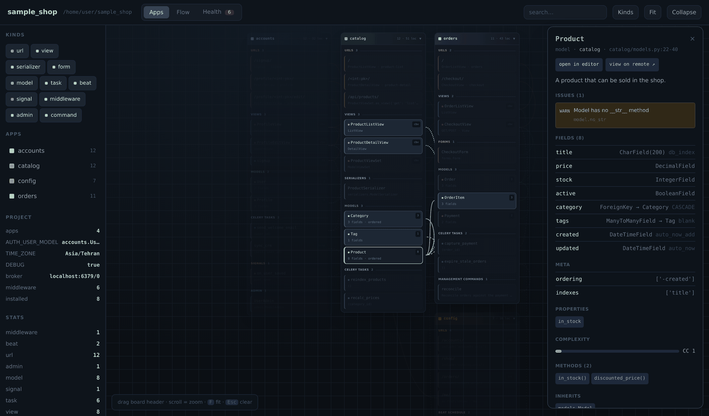

Selecting a node also **dims everything unrelated**, leaving just its neighbourhood lit:

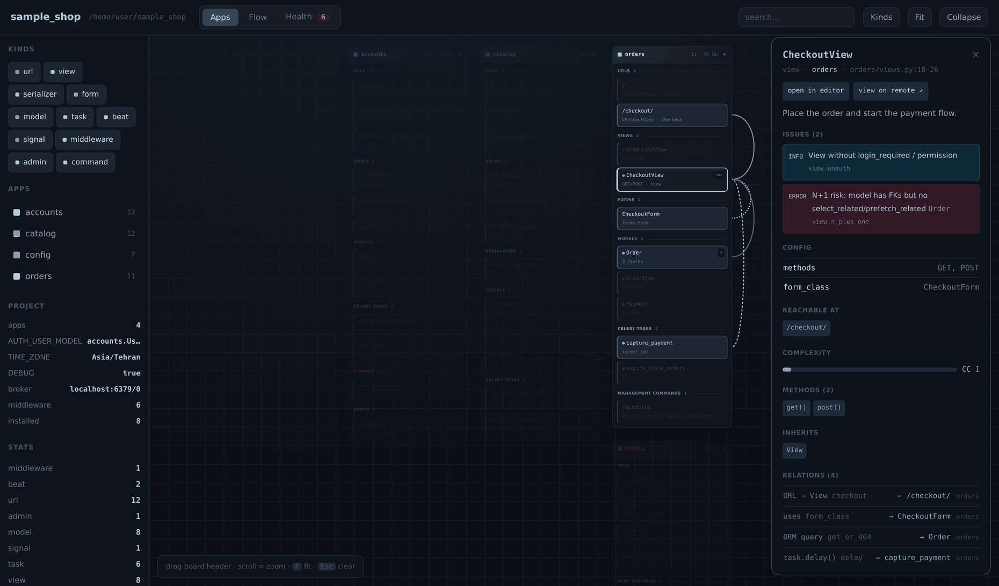

> Drag a board header to rearrange · scroll to zoom · `F` to fit · `Esc` to clear
> · collapse individual boards or all at once for a bird's-eye view

---

### 2 · Flow — how the system fits together

Four architecture views, switchable from the toolbar.

#### Request Lifecycle

The full path of an HTTP request through parallel lanes: Middleware → URLconf → View
→ Serializer/Form → Model, with a separate lane for async Celery work.

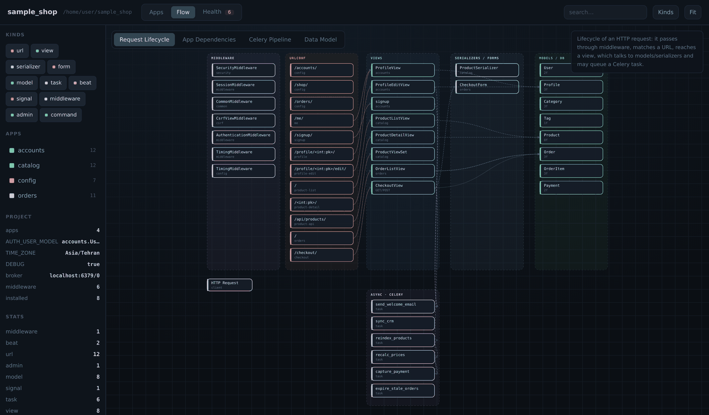

#### App Dependencies

Which apps import which, derived from real `import` statements, annotated with
reference counts. Circular dependencies show up immediately.

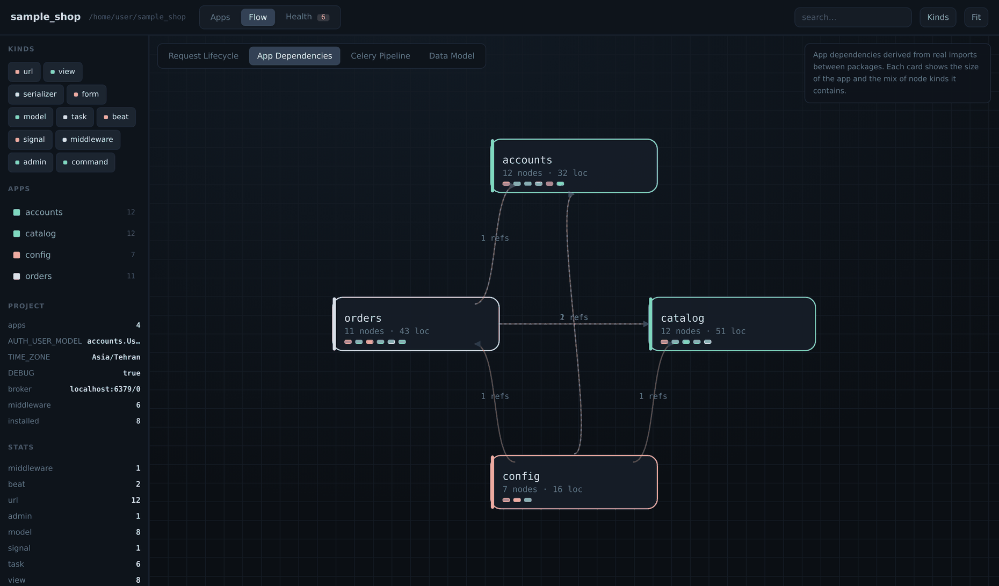

#### Celery Pipeline

Producers (views, signals, beat entries, management commands) → Broker → Workers →
Result backend, including task-to-task chains.

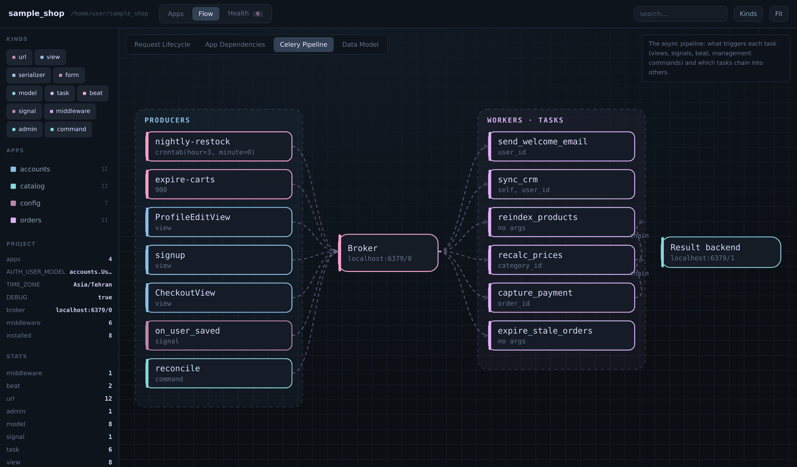

#### Data Model

A full ERD: every model with its fields, and the FK / M2M / O2O relations between
them, grouped by app.

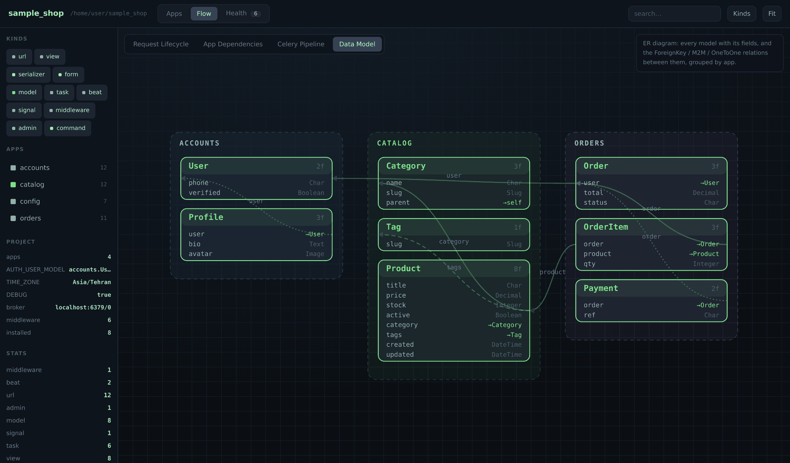

---

### 3 · Health — what is wrong

A 0–100 score plus issues grouped by check. **Click any issue to jump straight to that
card** in the Apps tab. Cards with problems get a coloured dot.

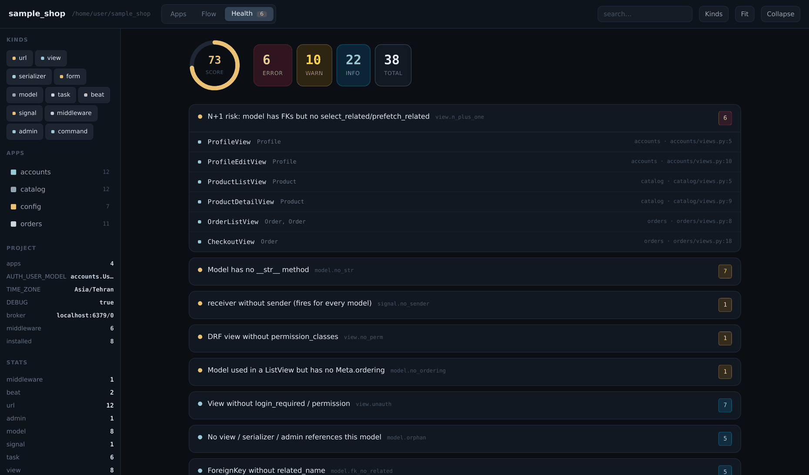

Below the issue list, a per-app breakdown shows where the debt is concentrated:

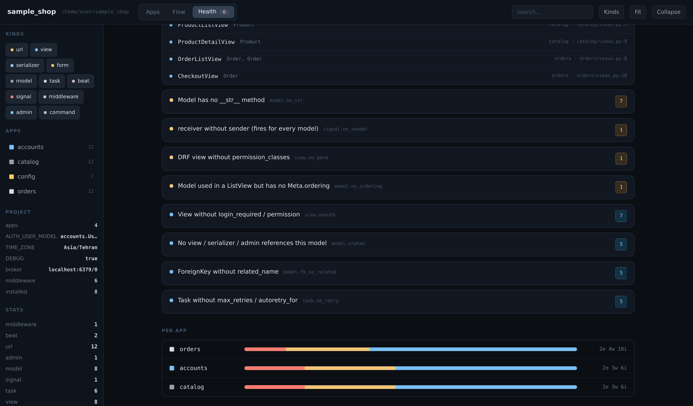

#### Checks

| Check | Severity | Meaning |
|---|---|---|
| `view.n_plus_one` | 🔴 error | Model has FKs but the view never calls `select_related`/`prefetch_related` |
| `url.no_view` | 🔴 error | URL is not wired to any known view |
| `app.cycle` | 🔴 error | Circular dependency between apps |
| `complexity.high` | 🟡 warn | Cyclomatic complexity ≥ 10 (error at ≥ 18) |
| `model.no_str` | 🟡 warn | Model has no `__str__`, so it renders as `Object (1)` in admin |
| `model.no_ordering` | 🟡 warn | Used in a `ListView` but has no `Meta.ordering` → unstable pagination |
| `url.no_name` | 🟡 warn | No `name=`, so it cannot be used with `reverse()` |
| `view.no_perm` | 🟡 warn | DRF view without `permission_classes` |
| `task.orphan` | 🟡 warn | Task is never called — no `delay()` and no beat schedule |
| `signal.no_sender` | 🟡 warn | `@receiver` without `sender` fires for *every* model |
| `model.fk_no_related` | 🔵 info | `ForeignKey` without `related_name` |
| `model.orphan` | 🔵 info | No view / serializer / admin references this model |
| `model.no_indexes` | 🔵 info | Many fields but no `db_index` anywhere |
| `task.no_retry` | 🔵 info | No `max_retries` / `autoretry_for` |
| `task.no_bind_retry` | 🔵 info | Uses `self.retry` but not declared with `bind=True` |
| `view.unauth` | 🔵 info | No `login_required` / permission mixin |

> `view.unauth` and `model.orphan` are heuristic and can be noisy on real projects,
> which is why they are `info` and barely affect the score.

---

## Responsive

The whole UI adapts down to a 320px phone.

<div align="center">
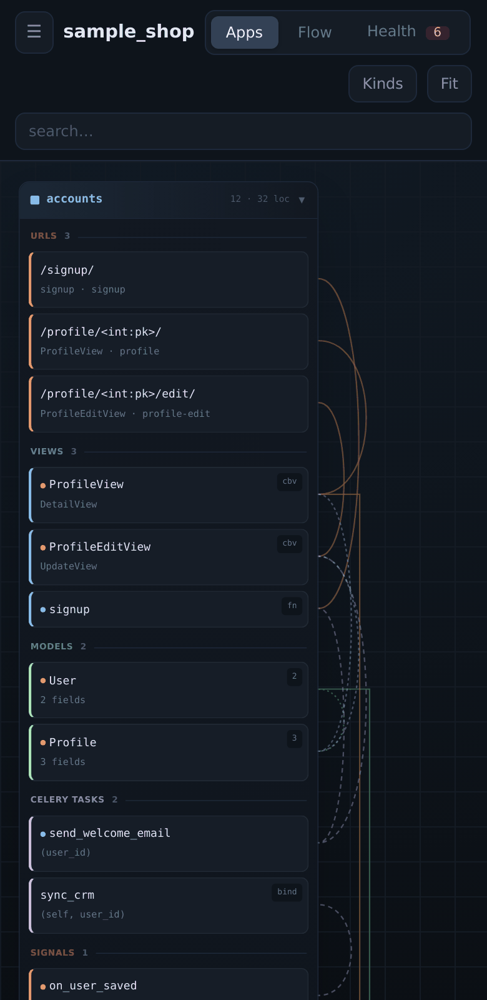
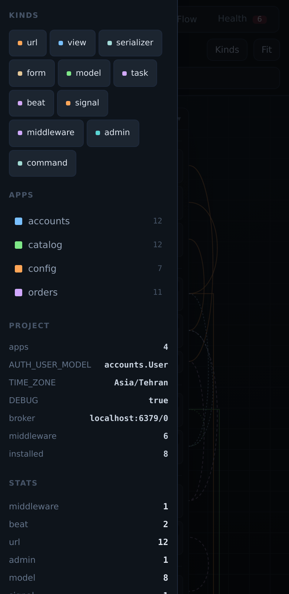
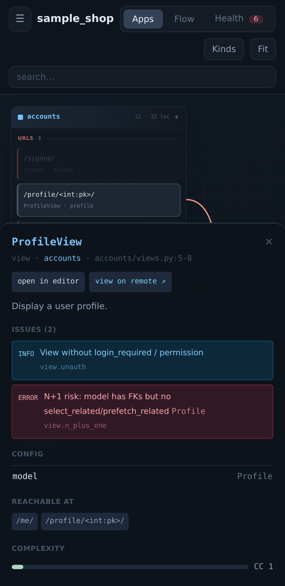
</div>

| Breakpoint | Behaviour |
|---|---|
| ≥ 1536px | Kind chips inline in the header |
| < 1536px | Kind filters move into the drawer via the **Kinds** button |
| ≥ 1024px | Sidebar always visible |
| < 1024px | Sidebar becomes an off-canvas drawer behind ☰ ; detail panel becomes a bottom sheet and diagrams auto-fit above it |
| < 760px | Flow layers stack vertically and fit to width |

Pinch-to-zoom and touch panning work on both canvases. Tablet reflows to two columns:

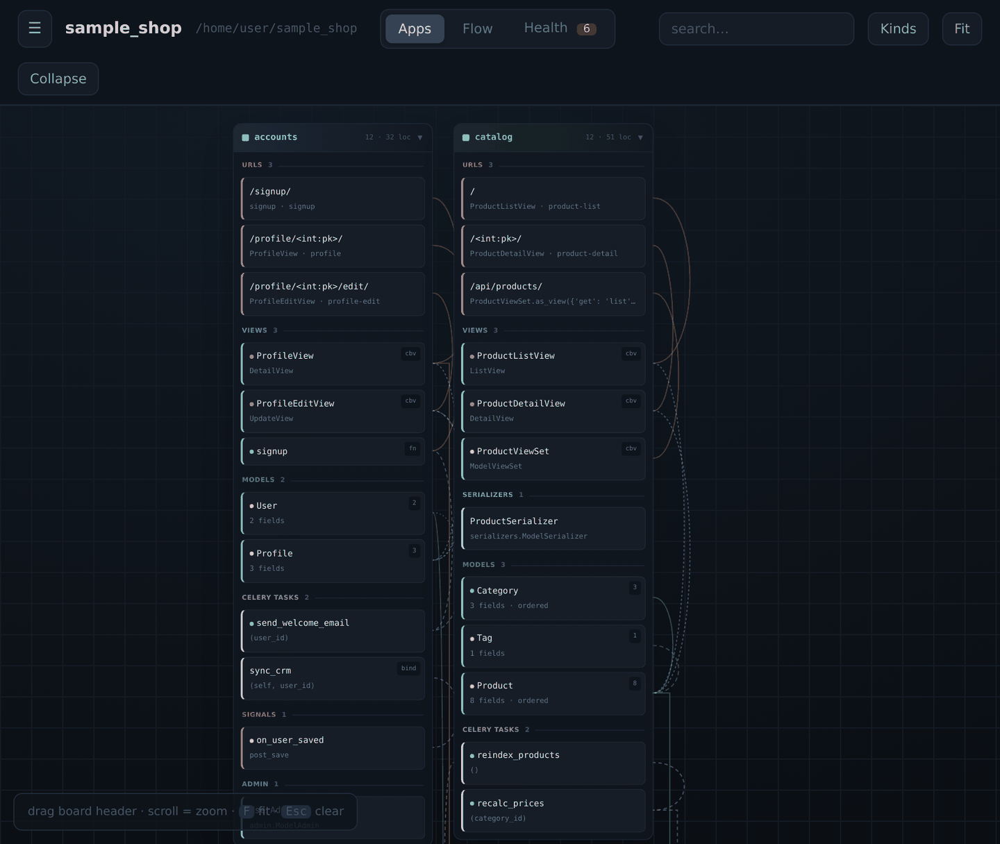

---

## CLI reference

```
djangomap [path] [options]
```

| Option | Description |
|---|---|
| `path` | Project root (default: `.`) |
| `-o, --out FILE` | Output HTML file (default: `djangomap.html`) |
| `--title TEXT` | Diagram title |
| `--json FILE` | Also dump the raw graph as JSON |
| `--apps-only` | Only scan detected Django apps (skip root scripts and config) |
| `--include-tests` | Also scan `tests/`, `simulation/` and `test_*.py` (excluded by default) |
| `--group-by {prefix,none}` | Group app boards by path prefix, e.g. `apps.*` / `auths.*` (default: `prefix`) |
| `--editor NAME` | `vscode` · `vscode-insiders` · `pycharm` · `none` |
| `--repo-url URL` | e.g. `https://github.com/me/proj` — enables "view on remote" links |
| `--branch NAME` | Branch for `--repo-url` (default: `main`) |
| `--format FMT` | Print a text diagram: `mermaid-erd` · `mermaid-flow` · `dot` |
| `--markdown FILE` | Write a Markdown report with an embedded Mermaid ERD |
| `--fail-on LEVEL` | Exit 1 if issues at `error` / `warn` / `info` exist |
| `--no-health` | Skip the health analysis |

### Text exports

Paste straight into a README or PR comment:

```bash
djangomap . --format mermaid-erd      # GitHub renders this natively
djangomap . --format mermaid-flow
djangomap . --format dot | dot -Tsvg -o graph.svg
djangomap . --markdown report.md
```

<details>
<summary><b>Example Mermaid output</b></summary>

```
erDiagram
    Product {
        Char title
        Decimal price
        ForeignKey category FK
        ManyToMany tags FK
    }
    Product ||--o{ Category : "category"
    Product }o--o{ Tag : "tags"
```
</details>

---

## CI integration

Fail the build when architectural errors appear:

```yaml
# .github/workflows/architecture.yml
name: Architecture
on: [push, pull_request]

jobs:
  djangomap:
    runs-on: ubuntu-latest
    steps:
      - uses: actions/checkout@v4
      - uses: actions/setup-python@v5
        with: { python-version: "3.12" }
      - run: pip install -e ./djangomap
      - run: djangomap . --fail-on error -o diagram.html
      - uses: actions/upload-artifact@v4
        if: always()
        with:
          name: architecture-diagram
          path: diagram.html
```

Every PR then carries a downloadable, up-to-date diagram of the codebase.

---

## Keyboard shortcuts & permalinks

| Key | Action |
|---|---|
| `1` `2` `3` | Switch to Apps / Flow / Health |
| `F` | Fit the current view |
| `Esc` | Clear the selection |

The active tab, flow view, selected node and every filter are encoded in the URL
`#hash`. Send the link to a teammate and they land on exactly the same view.

---

## What gets extracted

<details open>
<summary><b>Models</b></summary>

Every field with its type, `max_length`, `null` / `blank` / `unique` / `db_index` /
`primary_key`, `on_delete`, `related_name`, `default`, `help_text`, whether it has
`choices` — plus the `Meta` class, `@property` methods, custom managers and
cyclomatic complexity.
</details>

<details>
<summary><b>Views</b></summary>

CBV and FBV, HTTP methods (from `get`/`post` methods or `@api_view`), `model`,
`queryset`, `serializer_class`, `form_class`, `template_name`, `permission_classes`,
`authentication_classes`, `paginate_by`, `lookup_field`, `filter_backends`, and the
list of URLs that reach the view.
</details>

<details>
<summary><b>URLs</b></summary>

`path()` / `re_path()` / `url()` / `include()`, path converters like `<int:pk>`,
`name=`, extra kwargs, and DRF router `register()` calls.
</details>

<details>
<summary><b>Celery</b></summary>

`@shared_task`, `@app.task` and method-level tasks with their full argument
signature and options (`bind`, `max_retries`, `queue`, `rate_limit`, `autoretry_for`,
`acks_late`, `time_limit`, …), the `delay()` / `apply_async()` call chain, and every
`CELERY_BEAT_SCHEDULE` entry wired to its task.
</details>

<details>
<summary><b>Everything else</b></summary>

Signals (type + `sender`), middleware, management commands, forms, serializers
(`Meta.model`, `fields`, `read_only_fields`), admin classes (`list_display`,
`list_filter`, `search_fields`, registrations), and settings: `INSTALLED_APPS`,
`MIDDLEWARE`, `AUTH_USER_MODEL`, `ROOT_URLCONF`, broker and result backend.
</details>

### Relationship types

| Wire | Meaning |
|---|---|
| `fk` `m2m` `o2o` | Model relations |
| `routes` | URL → View |
| `calls` | `task.delay()` / `apply_async()` |
| `schedules` | Beat entry → task |
| `uses` | View → serializer / form / model |
| `queries` | ORM access inside a view or task |
| `manages` | Admin class → model |
| `listens` | Signal receiver → sender model |
| `inherits` | Class inheritance within the project |

---

## Large and non-standard layouts

djangomap does not assume that every app is a top-level directory with a flat
`models.py`. It discovers apps structurally, so the following all work:

**Nested app namespaces.** A `src/` root with apps under several packages —
`apps/crm/`, `auths/users/`, and a bare `core/` — is detected as 32 separate
apps, not 3. Boards are labelled with the short name and grouped in the sidebar
by their prefix.

**Apps as packages.** A directory is recognised as an app when it has a
`migrations/` folder, an `apps.py` declaring an `AppConfig`, or the usual
module set. Django modules may be **packages instead of files**:

```
apps/messenger/
├── models/messenger.py          → models
├── serializers/_chat_serializer.py  → serializers
├── apis/_chat_api.py            → views
├── urls/{regular_url,socket_routing}.py → urls
└── consumers/messenger.py       → WebSocket consumers
```

Each file's role is derived from its own name *or* its parent package, so
`core/models/base.py` and `crm/models.py` are both read as models.

**Channels.** `websocket_urlpatterns` and `AsyncJsonWebsocketConsumer`
subclasses are extracted as a dedicated `consumer` kind and routed via
`.as_asgi()`.

**Tests are excluded by default.** A mirrored `src/tests/apps/**` tree, plus
`test_*.py`, `conftest.py`, `factories.py` and `simulation/`, is skipped so
fixtures never inflate your model or view counts. Pass `--include-tests` to
include them.

**`INSTALLED_APPS` drives the layout.** djangomap locates your settings module
by content, not by a hard-coded path — `settings.py`, `config/settings/base.py`
and `web_config/environments/common.py` are all found automatically — then
reads `INSTALLED_APPS` and treats it as the authoritative app list. Entries may
be plain packages (`core`), dotted (`apps.crm`) or AppConfig paths
(`billing.apps.BillingConfig`); all resolve to the right directory. Boards are
ordered exactly as declared, and any app found on disk but *missing* from
`INSTALLED_APPS` is still shown, flagged with a `!` in the sidebar.

**Boards are partitioned by namespace.** On the Apps tab, each namespace gets
its own labelled band — `apps`, `auths`, `root` — and masonry packing happens
*within* a band, so `apps.crm` never ends up sitting next to `core` in the same
row. Projects with a single namespace get no headings. Use `--group-by none`
to switch back to one flat grid.

**Wide diagrams stay readable.** On the Flow tab, lanes with many nodes wrap
into sub-columns rather than stretching into one unreadably long strip.

## How it works

```
scanner.py    walks the tree, parses each .py with ast, emits nodes + edges
analysis.py   runs 16 checks over that graph, scores the project
export.py     renders Mermaid / DOT / Markdown
render.py     inlines the graph JSON + pre-built Tailwind into one HTML file
cli.py        argument parsing and orchestration
```

Because everything is AST-based, **your code is never executed** — safe to point at
an unfamiliar repository. The trade-off is that dynamically constructed URLconfs or
programmatically generated models won't be seen. For those, the graph is a very good
approximation rather than a perfect runtime reflection.

Migrations, `node_modules`, virtualenvs, caches and static dirs are skipped.

---

## Development

```bash
python -m djangomap.cli ./sample_shop -o demo.html    # run against the bundled sample
```

The Tailwind stylesheet is pre-built at `djangomap/tailwind.css`. Rebuild it after
editing `template.html`:

```bash
npx tailwindcss -c tailwind.config.js -i tw.css -o djangomap/tailwind.css --minify
```

The repo ships a `sample_shop/` Django project (4 apps, 8 models, 6 tasks, DRF,
Celery Beat, a management command) used for the screenshots above.

---

## Limitations

- Dynamic URLconfs and runtime-generated models are invisible to static analysis
- Third-party apps are only mapped if they live inside the scanned tree
- `related_name` reverse accessors that Django creates implicitly are not inferred
- The N+1 check is a heuristic: it flags missing `select_related` but cannot know
  whether the template actually traverses the relation

---

## License

Released under the [MIT License](LICENSE) — free for personal and commercial use.

```
Copyright (c) 2026 djangomap contributors
```

---

<div align="center">
<sub>Built with Python's <code>ast</code>, Tailwind CSS and hand-rolled SVG. No runtime dependencies.</sub>
</div>
